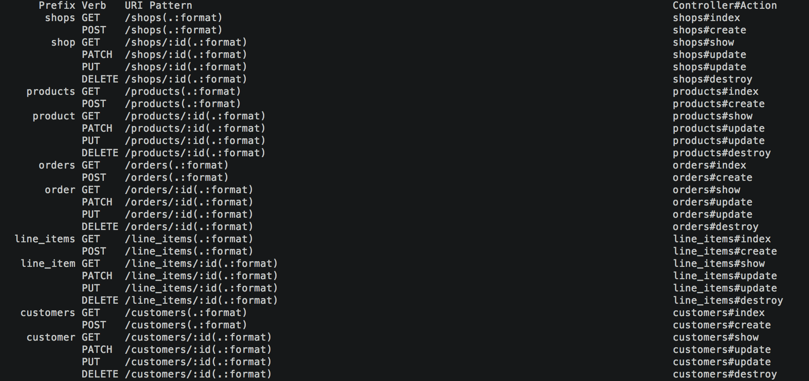

# shopify-winter-2019

This is a server-side web API made for the Shopify Winter 2019 Developer Intern
Challenge Question. This project is a Rails app with a SQLite3 db, and has been
dockerized and deployed to Google Kubernetes Engine.

Below you'll find how to interact with the API, the API documentation, and the
basic and bonus features that were implemented.

## Runbook

This web app is live on Google Kubernetes Engine with external IP
[http://35.232.253.129:80](http://35.232.253.129:80)
, so you can hit the API at this address.

Here are some example calls using `curl`:

```
$ curl http://35.232.253.129:80/shops
[{"id":1,"name":"test shop 1","revenue":"15.98","products":[{"id":1,"name":"milk","price":"1.5"},{"id":2,"name":"orange juice","price":"4.24"},{"id":3,"name":"bread","price":"2.0"}],"orders":[{"id":1,"price":"9.98"},{"id":2,"price":"6.0"}]},{"id":2,"name":"test shop 2","revenue":"9.0","products":[{"id":4,"name":"paper","price":"0.5"},{"id":5,"name":"notebook","price":"4.0"}],"orders":[{"id":3,"price":"9.0"}]}]

$ curl -X POST -H "Content-Type: application/json" -d '{"name":"leon","email":"le0n1sgre4t@xyz.com"}' http://35.232.253.129:80/customers
{"id":3,"name":"leon","email":"le0n1sgre4t@xyz.com","orders":[]}
```

Alternatively (although less recommended), you can also access the app's API by 
cloning the repo and running 
the app locally (assuming you already have `ruby` and `bundler` installed):

```
$ git clone https://github.com/LeozMaxwellJilliams/shopify-winter-2019.git
$ cd shopify-winter-2019
$ bundle install
$ rails db:setup
$ rails server
```

And then hitting the API at `localhost:3000`

## API

The following endpoints are defined:



All requests return the models' relevant attributes as well as their associations.

In this API:

`GET` requests do as expected, they return the objects you query for.

`DELETE` requests delete the specified objects.

`POST` requests create new objects, and they expect a JSON of parameters to 
create the object with.

`PATCH` and `PUT` requests update the specified objects, and they also expect a
JSON of parameters to update the object with.

To see exactly what attributes each model has (for the requests that take a
param JSON) you can checkout each model's source file (ie. `app/models/shop.rb` for Shop). 
The files are annotated
with each model's schema info.

Here are some example usages of the API:

Get all Products:

`$ curl http://35.232.253.129:80/products`

Get a specific LineItem (the one with id 2):

`$ curl http://35.232.253.129:80/line_items/2`

Create a Product:

`$ curl -X POST -H "Content-Type: application/json" -d '{"name":"banana","price":"3.99","shop_id":"2"}' http://35.232.253.129:80/products`

(notice here you need to specify the shop's foreign key for the Product to
be properly linked to its Shop)

Update a specific Shop (the one with id 1):

`$ curl -X PUT -H "Content-Type: application/json" -d '{"name":"new store title"}' http://35.232.253.129:80/shops/1`

Delete a specific Shop (the one with id 1):

`$ curl -X DELETE http://35.232.253.129:80/shops/1`

## Basic Features

* Shop, Product, Order, and LineItem models were created
* Their associations were created
* Basic validations such as ensuring all LineItems have an Order and Product
were added
* The price restraints were added - the price is only stored in the Product
model to avoid storing duplicate information and to avoid awkward updating.
LineItems and Orders get their price attribute from their associated Product
* Routes were created for all models to read, write, update, and delete 
* Serializers for all the models were created so that attributes not stored
in the db (such as price for everything except Product) and associations
can be returned
* Seed data was added
    * run `rails db:seed` to seed the db or `rails db:setup` 
    to initialize and seed the db
    * you can see what data is included in this seed file at `db/seeds.rb`

## Bonus Features

* This web API has been deployed to Google Kubernetes Engine
    * The app was dockerized (its docker image can be found [here](https://hub.docker.com/r/leozmaxwelljilliams/shopify-winter-2019/) on Docker Hub)
    * A 3 node cluster was setup on GKE
    * A Deployment managing 3 Pods of the app is live
    * A Service exposing the app's external IP was created
* All CRUD operations were supported
* The base functionality was extended:
    * A Customer model was created so shops can track who purchased Orders
    * A Shop's revenue is tracked so shops can know how much money they earned
* Documentation (this)
